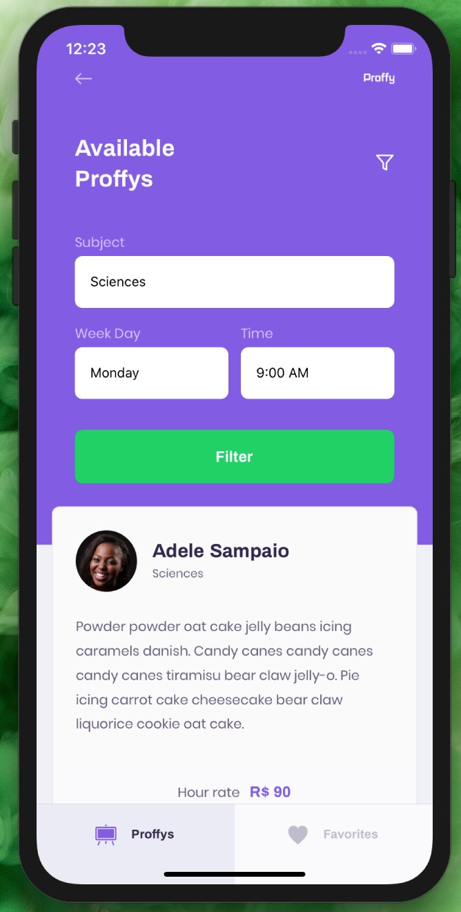
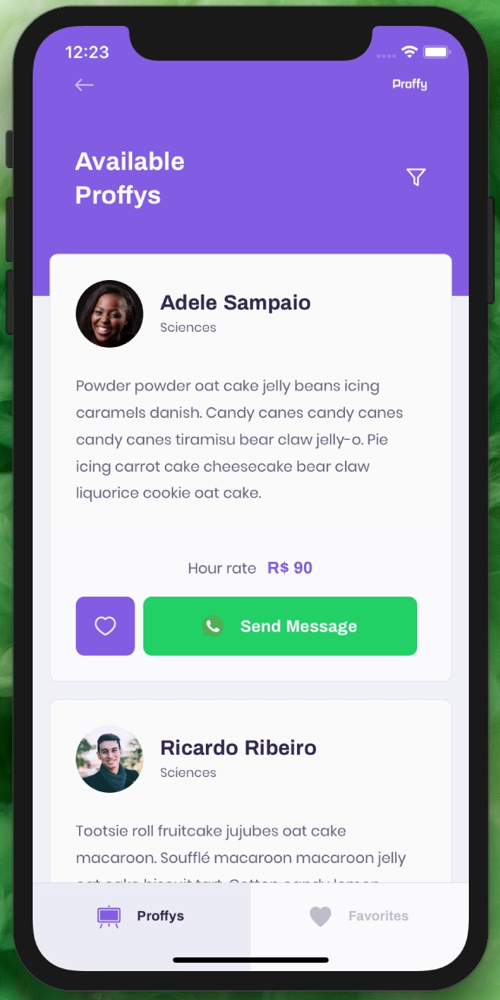

<h1 align="center">
    
     Next Level Week #2 
    NodeJS | ReactJS | React Native
</h1>

  

  

  

   

  

  

  

  <a href="#bookmark-about">About</a>&nbsp;&nbsp;&nbsp;|&nbsp;&nbsp;&nbsp;
  <a href="#rocket-dependencies">Dependencies</a>&nbsp;&nbsp;&nbsp;|&nbsp;&nbsp;&nbsp;
  <a href="#link-links">Links</a>

  
  
  
  
  
  

## :bookmark: About

Developed during the Education Week, **Proffy** simplifies the connection between
teachers and students by allowing classes to be filtered based on subject and
availability.

## :floppy_disk: Dependencies

-  [NodeJS](https://nodejs.org/en/) - v12.17.0
-  [Expo](https://expo.io/) - v38.0.8
-  [ReactJS](https://reactjs.org/) - v16.11.0
-  [React Native](http://facebook.github.io/react-native/) - v38.0.2

## :link: Links

- [Proffy - ReactJS](https://github.com/marina-ferreira/proffy-web)
- [Proffy - Express API](https://github.com/marina-ferreira/proffy-api)
